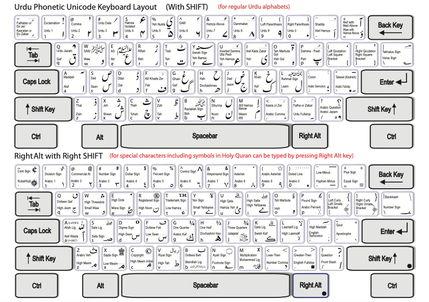

# Urdu Phonetic (Pak Urdu) Keyboard

This is a phonetic Urdu keyboard layout for Android. It is inspired by the classic Urdu phonetic keyboard used in InPage software and by the Urdu.ca phonetic keyboard layout.

The goal of this layout is simple: if you are already used to writing Urdu in InPage, you can type Urdu on Android in almost the same manner. The familiar English key positions are kept, so pressing a Roman key gives the Urdu letter normally associated with that sound.

## Keyboard Layout Reference

## Who This Layout Is For

This layout is best for people who:

- learned Urdu typing through InPage
- are comfortable with the InPage Urdu phonetic key positions
- want the same Urdu typing habit on an Android keyboard
- prefer phonetic Urdu typing instead of a native Urdu typewriter-style layout

## Main Keys

Normal tap gives the main Urdu letter. Shift gives the alternate InPage-style character.

### Letter Keys

| Key | Normal | Shift |
| --- | --- | --- |
| q | ق | ْ |
| w | و | ﷺ |
| e | ع | ؑ |
| r | ر | ڑ |
| t | ت | ٹ |
| y | ے | ؁ |
| u | ئ | ٗ |
| i | ی | ٰ |
| o | ہ | ۃ |
| p | پ | ُ |
| a | ا | ٓ |
| s | س | ص |
| d | د | ڈ |
| f | ف | ٖ |
| g | گ | غ |
| h | ح | ھ |
| j | ج | ض |
| k | ک | خ |
| l | ل | ؒ |
| z | ز | ذ |
| x | ش | ژ |
| c | چ | ث |
| v | ط | ظ |
| b | ب | ؓ |
| n | ن | ں |
| m | م | إ |

### Number Row

| Key | Normal | Shift |
| --- | --- | --- |
| 1 | ۱ | ! |
| 2 | ۲ | ، |
| 3 | ۳ | ؍ |
| 4 | ۴ | ء |
| 5 | ۵ | ۦ |
| 6 | ۶ | ؐ |
| 7 | ۷ | ٔ |
| 8 | ۸ | ٌ |
| 9 | ۹ | ( |
| 0 | ۰ | ) |

## Long-Press Keys

Because Android keyboards have less space than a full computer keyboard, some InPage/Urdu.ca characters are available through long press instead of separate visible keys.

Long-press popups include:

- Arabic and Urdu punctuation such as `،`, `؛`, `؟`, `۔`
- Urdu and Arabic number variants
- marks such as zabar, zer, pesh, shadda, sukoon, maddah, hamza marks, and superscript alef
- alternate Urdu letters and religious/Quranic symbols
- symbols from the original desktop-style layout that do not fit as separate Android keys

## Layout Rows

The visible Android layout uses these rows:

- Number row: `1 2 3 4 5 6 7 8 9 0`
- Top row: `q w e r t y u i o p`
- Middle row: `a s d f g h j k l`
- Bottom row: `z x c v b n m`

This keeps the keyboard compact while preserving the familiar phonetic Urdu typing flow.

## Notes

- This layout is made for Urdu typing in the style of InPage phonetic input.
- It is not a new Urdu typing system; it is intended to feel familiar for existing InPage users.
- Some desktop-only keys are moved to long press so the layout works naturally on Android.
